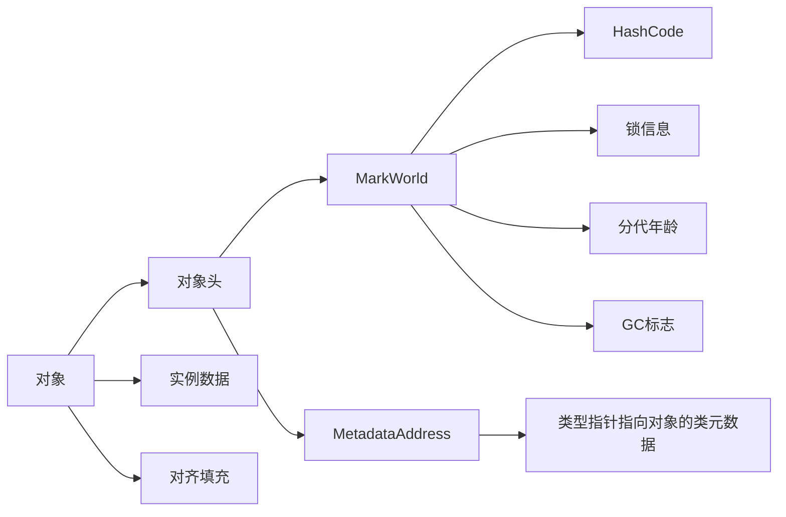

### 谈谈对多态的理解

多态的三个条件：

1. 继承
2. 重写
3. 向上转型（即父类引用指向子类对象）

### 多态的原理

Java的方法调用依赖类信息里的方法表实现的。

子类继承父类的方法，如果不override那么调用会指向父类的方法，如果override那么会指向该类的方法。

### char型变量中能否能不能存储一个中文汉字，为什么？

char是用来存储unicode编码的字符，unicode编码包含了汉字，所以char可以存储一个中文汉字。

不过由于某些特殊汉字不在unicode编码的字符集中，那么char就不能存储。

### HashMap在JDK7和JDK8中的区别

- JDK7中的HashMap
  - 基于数组+链表实现，底层维护了一个Entry数组
  - 发生hash冲突时，新元素总是插入到链表头中，旧元素移动到链表中
  - 扩容resize()时容易出现链表逆序，多线程下容易形成环形链表造成死循环
- JDK8中的HashMap
  - 基于数组+链表+红黑树实现，底层维护一个Node数组
  - 发生hash冲突时，先判断是链表还是红黑树，红黑树在树中插入数据，链表则在尾部插入
  - 扩容resize()时不会出现链表逆序，不易形成环形链表

### 静态代理与动态代理的区别

- 静态代理在代码运行之前就已存在
- 动态代理在代码运行时才动态生成

### synchronized 的实现原理

- 同步代码块使用的是monitorenter和monitorexit
- 同步方法使用的是ACC_SYNCHRONIZED标志

### 伪共享

伪共享：同一缓存行中的数据过期。

### 伪共享出现的原因

缓存系统是以缓存行（cache line）为单位存储的，当多线程修改相互独立的变量时，如果这些变量共享同一个缓存行。
根据缓存一致性协议（MESI），这些变量就会过期从而影响彼此的性能。

### 如何避免伪共享

字节填充，JDK8提供了 `sun.misc.Contended` 注解。

### 自旋锁

自旋锁：当一个线程在获取锁的时候，如果锁已经被其他线程获取，那么该线程将循环等待，然后不断地判断锁能否获取成功，知道获得锁才退出循环。

### 活锁

活锁：两个以上的线程在执行的时候，由于互相谦让资源，结果都拿不到资源。

### 线程池都有哪几种工作队列？

- ArrayBlockingQueue：基于数组的有界阻塞队列
- LinkedBlockingQueue：基于链表的阻塞队列
- SynchronousQueue：一个不存储元素的阻塞队列，插入操作必须等另一个线程调用移除操作
- PriorityBlockingQueue：具有优先级的无限阻塞队列

### Thread.sleep(0) 的作用

触发操作系统立刻重新进行一次CPU竞争。通常用在大循环中。

### Hashtable的size()方法中明明只有一条语句"return count"，为什么还要做同步

- 避免多线程下put元素后还未进行size++造成的不准确
- return count会被编译成多条汇编指令

