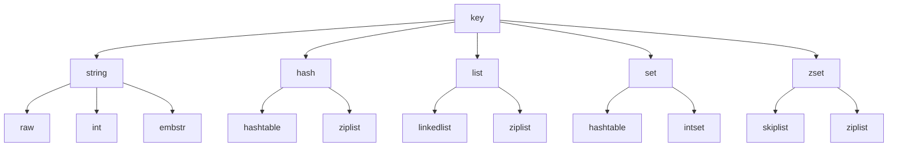

## 初识Redis

### Redis特性
- 速度快：10万/秒
- 基于键值对的数据结构服务器
- 丰富的功能
- 简单稳定
- 客户端语言多
- 持久化：RDB 和 AOF
- 主从复制
- 高可用和分布式
<!--more-->

速度快的原因：
  - 数据存放于内存中
  - C语言编写
  - 单线程，避免多线程产生的竞争问题

Reids的功能：
  - 键过期功能
  - 发布订阅功能
  - 支持Lua 脚本
  - 提供了简单的事务
  - 提供了流水线（Pipeline）功能

### 用好Redis的建议
1. 勿当作黑盒使用
2. 阅读源码

### Redis 基本操作

#### 安装
  - Linux 上通过源码安装
  - Mac 上通过Brew 安装

#### 配置、启动、操作、关闭

Redis 可执行文件说明：

| 可执行文件 | 作用 |
|--|--|
| redis-server | 启动Redis |
| redis-cli | Redis 命令行客户端 |
| redis-benchmark | Redis 基准测试工具 |
| redis-check-aof | Redis AOF 持久化文件检测和修复工具 |
| redis-check-dump | Redis RDB 持久化文件检测和修复工具 |
| redis-sentinel | 启动 Redis Sentinel |

Redis 基础配置：

| 配置名 | 配置说明 |
|--|--|
| port | 端口 |
| logfile | 日志文件 |
| dir | Redis 工作目录（存放持久化文件和日志文件）|
| daemonize | 是否以守护进程的方式启动Redis |

停止 Redis 服务：
`redis-cli shutdown` 用来停止Redis 服务，三点注意：
- Redis 关闭的过程：断开与客户端的连接、持久化文件生成，是一种相对优雅的关闭方式
- 除了`shutdown` 命令外，还可以通过`kill` 进程号的方式关掉Redis，但不可使用 `kill -9` 强制杀死Redis服务，不但不会做持久化操作，还会造成缓冲区等资源不能被优雅关闭，极端情况下会造成AOF和复制丢失数据的情况。
- `shutdown` 还有一个参数，代表是否在关闭Redis前，生成持久化文件：`redis-cli shutdown nosave|save`

### Redis 版本
  版本号第二位如果是奇数为非稳定版本，偶数代表稳定版本

## API的理解和使用

### 全局命令

| 命令 | 作用 |
|--|--|
| keys * | 查看所有键 |
| dbsize | 键总数，不会遍历所有键，而是直接获取Redis内置的键总数变量 |
| exists key | 检查键是否存在 |
| del key [key ...] | 删除键 |
| expire key seconds | 键过期 |
| ttl key | 查看键的过期时间 |
| type key | 键的数据结构类型 |
| object encoding key | 查询内部编码 |

### 数据结构和内部编码



Redis这样设计的好处：
- 可以改进内部编码，对外数据结构和命令没影响，例如Reids3.2的quicklist，结合了 ziplist 和 linkedlist 两者的优势
- 多种内部编码实现可以在不同场景下发挥各自的优势

### 单线程架构
单线程为什么这么快？
  - 纯内存访问
  - 非阻塞I/O
  - 单线程避免了线程切换和竞态的消耗

### 字符串

#### 字符串类型常用命令
| 命令 | 作用 |
|--|--|
| set key value [ex seconds] [px milliseconds] [nx xx] | 设置值 |
| setnx | 存在设置失败 |
| setex | 存在才能设置成功 |
| get key | 获取值 |
| mset key value [key value ...] | 批量设置值 |
| mget key [key ...] | 批量获取值 |
| incr key | 自增操作，值不是整数返回错误，键不存在按照 0 自增 |
| decr key | 自减操作 |
| incrby decrby incrbyfloat | 根据数值自增自减 |

#### 字符串类型不常用命令
| 命令 | 作用 |
|--|--|
| append key value | 追加值 |
| strlen key | 字符串长度 |
| getset key value | 设置并返回原值 |
| setrange key offset value | 设置指定位置的字符 |
| getrange key start end | 获取部分字符串 |

#### 字符串内部编码
  - int：8 个字节的长整型
  - embstr：小于等于 39 个字节的字符串
  - raw：大于 39 个字符的字符串

### 哈希

#### 哈希命令
| 命令 | 作用 |
|--|--|
| hset key field value | 设置值 |
| hget key field | 获取值 |
| hdel key field [field ...] | 删除field |
| hlen key | 计算field 个数 |
| hmget key field [field ...] | 批量获取field-value |
| hmset key field value [field value ...] | 批量设置field-value |
| hexists key field | 判断field 是否存在 |
| hkeys key | 获取所有field |
| hvals key | 获取所有value |
| hgetall key | 获取所有的field-value |
| hincrby hincrbyfloat key field | field 自增 |
| hstrlen key field | 计算value 的字符串长度 |

#### 内部编码
  - ziplist（压缩列表）：当哈希类型元素个数小于hash-max-ziplist-entries配置（默认512个），同时所有指都小于hash-max-ziplist-value配置（默认64字节）时，Redis 会使用ziplist 作为哈希的内部实现。
  - hashtable（哈希表）：当哈希类型无法满足ziplist 的条件时，Redis 会使用hashtable 作为哈希的内部实现，因为此时ziplist 的读写效率会下降，而hashtable 的读写时间复杂度为O(1)。

### 列表

#### 列表的两个特点：
  - 列表中的元素是有序的
  - 列表中的元素可以是重复的

#### 命令
| 命令 | 作用 |
|--|--|
| rpush lpush key value [value ...] | 添加 |
| linsert key (before after) pivot value | 插入 |
| lrange key start end | 查找 |
| lindex key index | 获取列表指定索引下表的元素 |
| llen key | 获取列表长度 |
| lpop rpop key | 弹出元素|
| lrem key count value | 删除指定元素，count>0，从左到右；count<0从右到左 删除最多count个元素；count=0，删除所有|
| ltrim key start end | 按照索引范围剪切列表 |
| lset key index newValue | 修改 |
| blpop brpop key [key ...] timeout | 阻塞操作 |

#### 内部编码
  - ziplist
  - linkedlist

#### 使用场景
  - 消息队列
  - 文章列表
  - lpush + lpop = Stack（栈）
  - lpush + rpop = Queue（队列）
  - lpush + ltrim = Capped Collection（有限集合）
  - lpush + brpop = Message Queue（消息队列）

### 集合
  Redis 除了支持集合内的增删改查，同时还支持多个结合取交集、并集、差集。

#### 命令
集合内操作：

| 命令 | 作用 |
|--|--|
| sadd key ele [ele ...] | 添加元素 |
| srem key ele [ele ...] | 删除元素 |
| scard key | 计算元素个数 |
| sismember key ele | 判断元素是否在集合中 |
| srandmember key [count:1] | 随机从集合返回指定个数元素 |
| spop key | 从集合随机弹出一个元素 |
| smember key | 获取所有元素 |

集合间操作：

| 命令 | 作用 |
|--|--|
| sinter key [key ...] | 求多个结合的交集 |
| suinon key [key ...] | 求多个结合的并集 |
| sdiff key [key ...] | 求多个集合的差集 |
| sinterstore sunionstore sdiffstore destination key [key ...] | 将交集、并集、差集的结果保存 |

集合间的运算在元素较多的情况下会比较耗时，Redis 提供了 store 命令将集合间交集、并集、差集的结果保存在 destination key 中。

#### 内部编码
  - intset（整数集合）：当集合中的元素都是整数且元素个数小于set-max-intset-entries配置（默认512个）时，Redis使用intset 作为集合的内部实现
  - hashtable（哈希表）：当集合类型无法满足intset 条件时，Redis 会使用hashtable 作为集合的内部实现

#### 使用场景
  - 标签

### 有序集合
  集合内元素不可重复，但可以排序。它给每个元素设置一个分数（score）作为排序的依据。

#### 命令
集合内：

| 命令 | 作用 |
|--|--|
| zadd key score memeber [score memeber ...] | 添加成员 |
| zcard key | 计算成员个数 |
| zscore key member | 计算某个成员的分数 |
| zrank zrevrank key member | 计算成员的排名 |
| zrem key memeber [member ...] | 删除成员 |
| zincrby key increment member | 增加成员的分数 |
| zrange zrevrange key start end [withscores] | 返回指定排名范围的成员 |
| zrangebyscore zrevrangebyscore key max min [withscores] [limit offset count] | 返回指定分数范围的成员 |
| zcount key min max | 返回指定分数范围成员个数 |
| zremrangebyrank key start end | 删除指定排名内的升序元素 |
| zremrangebyscore key min max | 删除指定分数范围的成员 |

Redis3.2为zadd添加了nx、xx、ch、incr 四个选项：
  - nx：member 必须不存在才能设置成功，用于添加
  - xx：member 必须存在才能设置成功，用于更新
  - ch：返回此次操作后，有序集合元素和分数变化的个数
  - incr：对score做增加，相当于zincrby

集合间的操作
  - 交集：
    `zinterstore destination numkeys key [key ...] [weights weight [weight ...]] [aggregate sum|min|max]`
    - destination：交集计算结果保存在这个键
    - numkeys：需要做交集计算键的个数
    - key[key ...]：需要做交集计算的键
    - weights weight[weight ...]：每个键的权重，每个键中的每个member 会将自己分数乘以这个权重，每个键的权重默认是 1
    - aggregate sum|min|max：计算成员交集后，分值可以按照sum、min、max 做汇总，默认是sum
  - 并集：
    `zunionstore destination numkeys key [key ...] [weights weight [weight ...]] [aggregate sum|min|max]`

#### 内部编码
  - ziplist（压缩列表）：当有序元素的元素个数小于zset-max-ziplist-entries配置（默认128个），同时每个元素的值都小于zset-max-ziplist-value配置（默认64字节）时，Redis会使用ziplist 作为有序集合的内部实现
  - skiplist（跳跃表）：当ziplist 条件不满足时，有序集合使用skiplist作为内部实现

#### 使用场景
  - 点赞数
  - 前十名
  - 用户分数

### 键管理

#### 单个键管理
| 命令 | 作用 |
|--|--|
| rename key newkey | 键重命名 |
| renamenx key newkey | newkey 不存在时重命名 |
| randomkey | 随机返回一个键 |
| expire key seconds | 键在seconds 秒后过期 |
| expireat key timestamp | 键在秒级时间戳timestamp 后过期 |
| pexpire key milliseconds | 键在milliseconds 毫秒后过期 |
| pexpireat key milliseconds-timestamp | 键在毫秒级时间戳timestamp 后过期 |
| move key db | 键内部迁移 |
| dump key | 键值序列化，采用RDB格式 |
| restore key ttl value | 反序列化键值 |
| migrate host port (key "") destination-db timeout [copy] [replace] [keys key [key ...]] | Redis 实例间进行数据迁移 |

Redis过期命令注意点：
  - expire key的键不存在，返回结果为 0
  - 过期时间如果为负值，键会立即被删除
  - persist 可以将键的过期时间清除
  - 对于字符串类型键，set 命令会去掉过期时间
  - Redis 不支持二级数据结构内部元素的过期功能
  - setex 命令作为set+expire的组合，不但是原子操作，同时减少了一次网络通讯的时间

migrate 参数：
  - host：目标Redis 的IP地址
  - port：目标Redis 的端口
  - key|""：Redis3.0.6之前，只支持迁移一个键，Redis3.0.6 之后支持迁移多个键，需要迁移多个键时，为空字符串“”
  - destination：目标Redis 的数据库索引
  - timeout：迁移的超时时间（毫秒）
  - [copy]：添加后，迁移不删除源键
  - [replace]：添加后，不管目标Redis 是否存在该键都会正常迁移并进行数据覆盖
  - [keys key[key ...]]：迁移多个键

#### 遍历键
- `keys pattern`：全量遍历键
  keys 命令可能会造成Redis 阻塞，不建议使用，当需要遍历键时：
    - 在一个不对外提供的Redis 从节点上执行，不会阻塞到客户端的请求，但会影响主从复制
    - 如果确认键值总数确实比较少，可以执行该命令
    - 使用scan 命令，可以有效防止阻塞
- `scan cursor [match pattern] [count number]`：渐进式遍历
  - curosr：必须参数，每次scan 遍历完都会返回当前游标的值，知道游标值为0，表示遍历结束
  - match pattern：可选参数，匹配正则
  - count number：可选参数，每次要遍历的键个数，默认是 10

除了scan 以外，Redis还提供了面向哈希、集合、有序列表的扫描遍历命令：hscan、sscan、zscan

#### 数据库管理
| 命令 | 作用 |
|--|--|
| select dbIndex | 切换数据库，Redis默认配置中有16个数据库 |
| flushdb | 清除当前数据库 |
| flushall | 清除所有数据库 |

  **注意**：Redis 的分布式实现Redis Cluster 只允许使用 0 号数据库，原因：
  - Redis 单线程，多数据库仍然使用一个CPU，彼此之间还是会有影响
  - 多数据库的使用方式，会让调试和运维不同业务的数据库变得困难，比如一个慢查询，仍然会影响其他数据库
  - 部分Redis 的客户端根本不支持这种方式，即使支持，在开发时来回切换数字形势的数据库，容易弄乱

## 小功能大用处

### 慢查询分析
Redis 提供了`slowlog-log-slower-than` 来设置阀值（微妙，默认 10000，=0时会记录所有的命令，<0时不会进行记录） `slowlog-max-len` 设置慢查询日志的最大条数
```shell
config set slowlog-log-slower-than 20000
config set slowlog-max-len 1000
config rewrite
# 获取慢查询日志
slowlog get [n]
# 获取慢查询日志列表当前的长度
slowlog len
# 慢查询日志重置
slowlog reset
```

### redis-cli 详解
| 参数 | 作用 |
|--|--|
| -r | 命令执行多次 |
| -i | 每隔几秒执行一次 |
| -x | 从标准输入读取数据作为最后一个参数 |
| -c | 连接Redis Cluster 节点时使用 |
| -a | Redis 配置了命令时使用 |
| --scan 和 --pattern | 用于扫描指定模式的键 |
| --slave | 把当前客户端模拟成当前Redis 节点的从节点 |
| --rdb | 请求Redis实例生成并发送RDB持久化文件保存到本地 |
| --pipe | 批量执行Redis 命令 |
| --bigkeys | 使用scan 命令对Redis 的键进行采样，找出内存占用较大的键值 |
| --eval | 执行Lua 脚本 |
| --latency | 检测网络延迟 |
| --latency-history | 分时段了解延迟信息 |
| --latency-dist | 使用统计图表输出延迟统计信息 |
| --stat | 实时获取Redis 的重要统计信息 |
| --no-raw | 要求命令的返回结果必须是原始的格式 |
| --raw | 要求命令的返回结果是转换后的格式 |

### redis-server 详解
参数 `--test-memory` 用来检测当前系统能否稳定的分配指定容量的内存给Redis

### redis-benchmark 详解
redis-benchmark 可以为Redis做基准性能测试

| 参数 | 作用 |
|--|--|
| -c | 客户端的并发数（默认50）|
| -n | 客户端请求总量（默认100000）|
| -r | 插入随机的键做测试 |
| -P | 每个请求pipeline 的数据量（默认1）|
| -k | 是否使用keepalive，1为使用，0为不使用 |
| -t | 对指定命令进行基准测试 |
| --csv | 将结果按照csv格式输出 |

### Pipeline
有效节约RTT（Round Trip Time，往返时间）

### 事务与Lua
Redis 提供了简单的事务功能，将一组需要一起执行的命令放到mulit 和 exec 两个命令之间，multi 代表事务开始，exec 代表事务结束。

#### 不同错误下的处理机制
1. 命令错误：整个事务无法执行
2. 运行时异常：不支持回滚

#### Lua
```lua
-- 没有local代表是全局变量
local strings val = "world"
print(val)
-- 表格，下标从 1 开始
local tables myArray = {"redis", "jedis", true, 88.0}
print(myArray[3])
-- for循环
local int sum = 0
for i = 1, 100
do
    sum = sum + i
end
print(sum)
for i = 1, #myArray
do
    print(myArray[i])
end
-- ipairs函数，返回索引下标和值
for index,value in ipairs(myArray)
do
    print(index)
    print(value)
end
-- while
local int sum = 0
local int i = 0
while i <= 100
do
    sum = sum + 1
    i = i + 1
end
print(sum)
-- if else
for i = 1, #myArray
do
    if myArray[i] == "jedis"
    then
        print("true")
        break
    else
        -- do nothing
    end
end
-- 哈希
local tables user_1 = {age = 28, name = "tom"}
print("user_1 age is" .. user_1["age"])
for key,value in pairs(user_1)
do print(key .. value)
end
-- 函数定义
function contact(str1, str2)
    return str1 .. str2
end
print(contact("hello", "world"))
```

#### Redis中使用Lua
- eval
  Redis 中执行`eval script key_num keys args`:
  ```shell
  127.0.0.1:6379> eval 'return "hello " .. KEYS[1] .. ARGV[1]' 1 redis world
  ```
  如果Lua 脚本较长，可以使用redis-cli --eval 直接执行文件
- evalsha
  首先将Lua脚本加载到Redis 服务端，得到该脚本的SHA1校验和，evalsha 使用SHA1 作为参数可以直接执行对应Lua脚本，避免每次发送Lua 脚本的开销
  ```shell
  redis-cli script load "$(cat lua_get.lua)"
  evalsha sha1_value key_num keys args
  ```

#### Lua的Redis API
Lua 可以使用redis.call、redis.pcall  函数实现对Redis 的访问，两者区别是 redis.call 执行失败，脚本立即返回错误，redis.pcall 会忽略错误继续执行脚本
```lua
redis.call("set", "hello", "world")
redis.call("get", "hello")
```

#### Redis 如何管理Lua脚本
- `script load script`：将Lua 脚本加载到Redis内存中
- `script exists sha1`：判断sha1 是否已经加载到Redis内存中
- `script flush`：清除已经加载的所有Lua脚本
- `script kill`：用于杀掉正在执行的Lua脚本，Redis 提供了`lua-time-limit` 参数，默认是 5 秒，但只是当Lua 脚本时间超过`lua-time-limit` 后向其他命令调用发送BUSY 信号，并不会停止服务端和客户端的脚本执行。如果Lua脚本正在执行写操作，`script kill` 将不会生效，此时要么等待脚本结束要么使用 `shutdown save` 停掉Redis服务

### Bitmaps
- Bitmaps 不是一种数据结构，实际上就是字符串，但可以对字符串的位进行操作
- Bitmaps Bitmaps 类似一个以位为单位的数组，数组的每个单位只能存储0和1，数组的下标在Bitmaps中叫偏移量

#### Bitmaps命令
| 命令 | 作用 |
|--|--|
| setbit key offset value | 设置值 |
| getbit key offset | 获取值 |
| bitcount [start] [end] | 获取Bitmaps 指定范围为 1 的个数 |
| bitop op destkey key[key ...] | Bitmaps间的运算: and、or、not、xor |
| bitpos key targetBit [start] [end] | 计算Bitmaps中第一个值为targetBit的偏移量 |

### HyperLogLog
HyperLogLog并不是一种新的数据结构（实际类型为字符串），而是一种基数算法，通过HyperLogLog可以利用极小的内存空间完成独立总数的统计。

| 命令 | 作用 |
|--|--|
| pfadd key element [element ...] | 添加 |
| pfcount key [key ...] | 去重计数，存在一定误差 |
| pfmerge destkey sourcekey [sourcekey ...] | 合并 |

在选择HyperLogLog 时，需要确认两点：
- 只是为了计算独立总数，不需要获取单条数据
- 可以容忍一定误差

### 发布订阅

| 命令 | 作用 |
|--|--|
| publish channel message | 发布消息 |
| subscribe channel [channel ...] | 订阅消息 |
| unsubscribe [channel [channel ...]] | 取消订阅 |
| psubscribe pattern [pattern ...] | 按照模式订阅 |
| punsubscribe [pattern [pattern ...]] | 按照模式取消订阅 |
| pubsub channels [pattern] | 查看活跃的频道 |
| pubsub numsub [channel ...] | 查看频道订阅数 |
| pubsub numpat | 查看模式订阅数 |

订阅命令的注意点：
- 客户端执行订阅命令之后进入了了订阅状态，只能接收`subscribe`、`psubscribe`、`unsubscribe`、`punsubscribe`这四个命令
- 新开启的订阅客户端，无法接收到该频道之前的消息，因为Redis不会对发布的消息进行持久化

活跃的频道是指当前频道至少有一个订阅者

### GEO（地理信息定位）
Redis3.2 版本提供了GEO功能。

| 命令 | 作用 |
|--|--|
| geoadd key longitude latitude member [longitude latitude memeber ...] | 增加地理位置信息 |
| geopos key member [memeber ...] | 获取地理位置信息 |
| geodist key member1 member2 [unit] | 获取两个地理位置的距离 |
| georadius key longitude latitude (radiusm km ft mi) [withcoord] [withdist] [withhash] [COUNT count] [asc desc] [store key] [storedist key] | 获取指定位置范围内的地理信息位置集合 |
| georadiusbymember key member (radiusm km ft mi) [withcoord] [withdist] [withhash] [COUNT count] [asc desc] [store key] [storedist key] | 获取指定位置范围内的成员信息 |
| geohash key member [member ...] | 获取geohash |
| zrem key member | 删除地理位置信息 |

参数：
- withcoord：返回结果中包含经纬度
- withdist：返回结果中包含离中心节点位置的距离
- withhash：返回结果中包含geohash
- COUNT count：指定返回结果的数量
- asc\|desc：返回结果按照离中心节点的距离做升序或者降序
- store key：将返回结果的地理位置信息保存到指定键
- storedist key: 将返回结果离中心节点的距离保存到指定键

`geohash`的特点：
- GEO的数据类型为zset，Redis将所有地理位置信息的geohash存放在zset中
- 字符串越长，表示的位置更精确
- 两个字符串越相似，它们之间的距离越近
- geohash编码和经纬度是可以互换的

## 客户端

