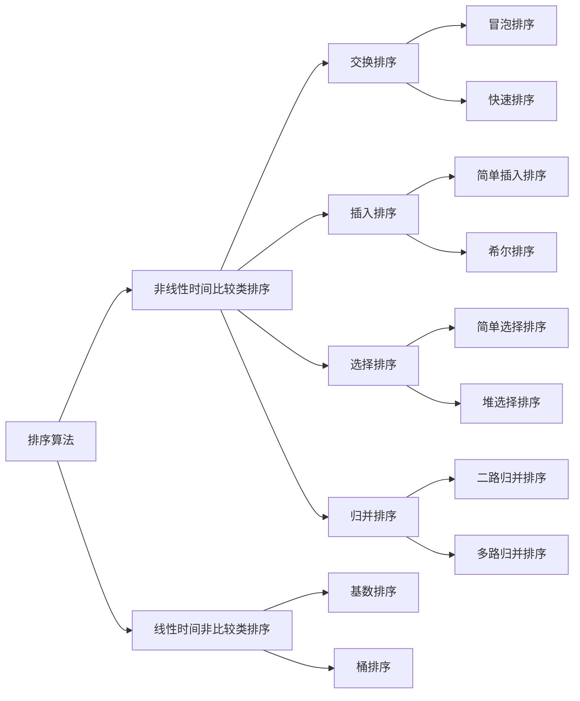

#### 算法分类

十种常见排序算法可以分为两大类：

- 非线性时间比较类排序：通过比较来决定元素间的相对次序，由于其时间复杂度不能突破O($n\log_n$)，因此称为非线性时间比较类排序。
- 线性时间非比较类排序：不通过比较来决定元素间的相对次序，它可以突破基于比较排序的时间下界，以线性时间运行，因此称为线性时间非比较类排序。



#### 算法复杂度


#### 相关概念

稳定：如果a原本在b前面，而a=b，排序之后a仍然在b的前面。

不稳定：如果a原本在b的前面，而a=b，排序之后 a 可能会出现在 b 的后面。

时间复杂度：对排序数据的总的操作次数。反映当n变化时，操作次数呈现什么规律。

空间复杂度：是指算法在计算机内执行时所需存储空间的度量，它也是数据规模n的函数。

#### 1. 冒泡排序（Bubble Sort）

冒泡排序是一种简单的排序算法。它重复地走访过要排序的数列，一次比较两个元素，如果它们的顺序错误就把它们交换过来。走访数列的工作是重复地进行直到没有再需要交换，也就是说该数列已经排序完成。这个算法的名字由来是因为越小的元素会经由交换慢慢“浮”到数列的顶端。

##### 1.1 算法描述

1. 比较相邻的元素。如果第一个比第二个大，就交换它们两个；
2. 对每一对相邻元素作同样的工作，从开始第一对到结尾的最后一对，这样在最后的元素应该会是最大的数；
3. 针对所有的元素重复以上的步骤，除了最后一个；
4. 重复步骤1~3，直到排序完成。

##### 1.2 动图演示


##### 1.3 代码实现

```java
public class BubbleSort {

    public void sort(int[] arr) {
        int len = arr.length;
        for (int i = 0; i < len - 1; i++) {
            for (int j = 0; j < len - 1 - i; j++) {
                // 相邻元素两两对比
                if (arr[j] > arr[j + 1]) {
                    // 元素交换
                    int temp = arr[j + 1];
                    arr[j + 1] = arr[j];
                    arr[j] = temp;
                }
            }
        }
    }
}
```

#### 2. 选择排序（Selection Sort） 

选择排序(Selection-sort)是一种简单直观的排序算法。它的工作原理：首先在未排序序列中找到最小（大）元素，存放到排序序列的起始位置，然后，再从剩余未排序元素中继续寻找最小（大）元素，然后放到已排序序列的末尾。以此类推，直到所有元素均排序完毕。

##### 2.1 算法描述

n个记录的直接选择排序可经过n-1趟直接选择排序得到有序结果。具体算法描述如下：

1. 初始状态：无序区为R[1..n]，有序区为空；
2. 第i趟排序(i=1,2,3…n-1)开始时，当前有序区和无序区分别为R[1..i-1]和R(i..n）。该趟排序从当前无序区中-选出关键字最小的记录 R[k]，将它与无序区的第1个记录R交换，使R[1..i]和R[i+1..n)分别变为记录个数增加1个的新有序区和记录个数减少1个的新无序区；
3. n-1趟结束，数组有序化了。

##### 2.2 动图演示


##### 2.3 代码实现

```java
public class SelectionSort {

    public void sort(int[] arr) {
        int n = arr.length;
        for (int i = 0; i < n; i++) {
            int minIndex = i;
            for (int j = i + 1; j < n; j++) {
                // 寻找最小的数
                if (arr[minIndex] > arr[j]) {
                    // 将最小数的索引保存
                    minIndex = j;
                }
            }
            if (i != minIndex) {
                int temp = arr[i];
                arr[i] = arr[minIndex];
                arr[minIndex] = temp;
            }
        }
    }
}
```

##### 2.4 算法分析

表现最稳定的排序算法之一，因为无论什么数据进去都是$O(n^2)$的时间复杂度，所以用到它的时候，数据规模越小越好。唯一的好处可能就是不占用额外的内存空间了吧。理论上讲，选择排序可能也是平时排序一般人想到的最多的排序方法了吧。

#### 3. 插入排序（Insertion Sort）

插入排序（Insertion-Sort）的算法描述是一种简单直观的排序算法。它的工作原理是通过构建有序序列，对于未排序数据，在已排序序列中从后向前扫描，找到相应位置并插入。

##### 3.1 算法描述

一般来说，插入排序都采用in-place在数组上实现。具体算法描述如下：

1. 从第一个元素开始，该元素可以认为已经被排序；
2. 取出下一个元素，在已经排序的元素序列中从后向前扫描；
3. 如果该元素（已排序）大于新元素，将该元素移到下一位置；
4. 重复步骤3，直到找到已排序的元素小于或者等于新元素的位置；
5. 将新元素插入到该位置后；
6. 重复步骤2~5。

##### 3.2 动图演示


##### 3.3 代码实现

```java
public class InsertionSort {

    public void sort(int[] arr) {
        int len = arr.length;
        int preIndex, current;
        for (int i = 1; i < len; i++) {
            preIndex = i - 1;
            current = arr[i];
            while (preIndex >= 0 && arr[preIndex] > current) {
                arr[preIndex + 1] = arr[preIndex];
                preIndex--;
            }
            arr[preIndex + 1] = current;
        }
    }
}
```

##### 3.4 算法分析

插入排序在实现上，通常采用in-place排序（即只需用到$O(1)$的额外空间的排序），因而在从后向前扫描过程中，需要反复把已排序元素逐步向后挪位，为最新元素提供插入空间。

#### 4. 希尔排序（Shell Sort） 

1959年Shell发明，第一个突破$O(n^2)$的排序算法，是简单插入排序的改进版。它与插入排序的不同之处在于，它会优先比较距离较远的元素。希尔排序又叫缩小增量排序。

##### 4.1 算法描述

先将整个待排序的记录序列分割成为若干子序列分别进行直接插入排序，具体算法描述：

1. 选择一个增量序列t1，t2，…，tk，其中ti>tj，tk=1；
2. 按增量序列个数k，对序列进行k 趟排序；
3. 每趟排序，根据对应的增量ti，将待排序列分割成若干长度为m 的子序列，分别对各子表进行直接插入排序。仅增量因子为1 时，整个序列作为一个表来处理，表长度即为整个序列的长度。

##### 4.2 动图演示


##### 4.3 代码实现

```java
public class ShellSort {

    public void sort(int[] arr) {
        int n = arr.length;
        for (int h = n / 2; h > 0; h /= 2) {
            for (int i = h; i < n; i++) {
                for (int j = i - h; j >= 0; j -= h) {
                    if (arr[j] > arr[j + h]) {
                        int temp = arr[j];
                        arr[j] = arr[j + h];
                        arr[j + h] = temp;
                    }
                }
            }
        }
    }
}
```

##### 4.4 算法分析

希尔排序的核心在于间隔序列的设定。既可以提前设定好间隔序列，也可以动态的定义间隔序列。动态定义间隔序列的算法是《算法（第4版）》的合著者Robert Sedgewick提出的。

#### 5. 归并排序（Merge Sort） 

归并排序是建立在归并操作上的一种有效的排序算法。该算法是采用分治法（Divide and Conquer）的一个非常典型的应用。将已有序的子序列合并，得到完全有序的序列；即先使每个子序列有序，再使子序列段间有序。若将两个有序表合并成一个有序表，称为2-路归并。

##### 5.1 算法描述

1. 把长度为n的输入序列分成两个长度为n/2的子序列；
2. 对这两个子序列分别采用归并排序；
3. 将两个排序好的子序列合并成一个最终的排序序列。

##### 5.2 动图演示


##### 5.3 代码实现

```java
public class MergeSort {

    public void sort(int[] array, int low, int high) {
        int middle = (low + high) / 2;
        if (low < high) {
            sort(array, low, middle);
            sort(array, middle + 1, high);
            merge(array, low, middle, high);
        }
    }

    public void merge(int[] array, int low, int middle, int high){
        int[] temp = new int[high - low + 1];
        int i = low;
        int j = middle + 1;
        int k = 0;
        while (i <= middle && j <= high) {
            if (array[i] < array[j]) {
                temp[k++] = array[i++];
            } else {
                temp[k++] = array[j++];
            }
        }
        while (i <= middle) {
            temp[k++] = array[i++];
        }
        while (j <= high) {
            temp[k++] = array[j++];
        }
        for (int m = 0; m < temp.length; m++) {
            array[m + low] = temp[m];
        }
    }
}
```

##### 5.4 算法分析

归并排序是一种稳定的排序方法。和选择排序一样，归并排序的性能不受输入数据的影响，但表现比选择排序好的多，因为始终都是O(nlogn）的时间复杂度。代价是需要额外的内存空间。

#### 6. 快速排序（Quick Sort） 

快速排序的基本思想：通过一趟排序将待排记录分隔成独立的两部分，其中一部分记录的关键字均比另一部分的关键字小，则可分别对这两部分记录继续进行排序，以达到整个序列有序。

##### 6.1 算法描述

快速排序使用分治法来把一个串（list）分为两个子串（sub-lists）。具体算法描述如下：

1. 从数列中挑出一个元素，称为 “基准”（pivot）；
2. 重新排序数列，所有元素比基准值小的摆放在基准前面，所有元素比基准值大的摆在基准的后面（相同的数可以到任一边）。在这个分区退出之后，该基准就处于数列的中间位置。这个称为分区（partition）操作；
3. 递归地（recursive）把小于基准值元素的子数列和大于基准值元素的子数列排序。

##### 6.2 动图演示


##### 6.3 代码实现

```java
public class QuickSort {

    public void sort(int[] arr, int left, int right) {
        if (left < right) {
            int pivot = arr[left];
            int low = left;
            int high = right;
            while (low < high) {
                while (low < high && arr[high] >= pivot) {
                    high--;
                }
                arr[low] = arr[high];
                while (low < high && arr[low] <= pivot) {
                    low++;
                }
                arr[high] = arr[low];
            }
            arr[low] = pivot;
            sort(arr, left, low - 1);
            sort(arr, low + 1, right);
        }
    }
}
```

#### 7. 堆排序（Heap Sort）

堆排序（Heapsort）是指利用堆这种数据结构所设计的一种排序算法。堆积是一个近似完全二叉树的结构，并同时满足堆积的性质：即子结点的键值或索引总是小于（或者大于）它的父节点。

##### 7.1 算法描述

1. 将初始待排序关键字序列(R1,R2….Rn)构建成大顶堆，此堆为初始的无序区；
2. 将堆顶元素R[1\]与最后一个元素R[n\]交换，此时得到新的无序区(R1,R2,……Rn-1)和新的有序区(Rn),且满足R[1,2…n-1\]<=r[n\]；< span=""></=r[n\]；
3. 由于交换后新的堆顶R[1\]可能违反堆的性质，因此需要对当前无序区(R1,R2,……Rn-1)调整为新堆，然后再次将R[1\]与无序区最后一个元素交换，得到新的无序区(R1,R2….Rn-2)和新的有序区(Rn-1,Rn)。不断重复此过程直到有序区的元素个数为n-1，则整个排序过程完成。

##### 7.2 动图演示


##### 7.3 代码实现

```java

```